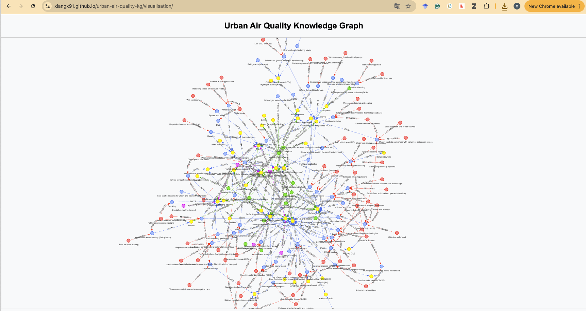

# Enhancing Urban Air Quality Understanding with Knowledge Graphs and Retrieval-Augmented Generation

## Overview

This project provides a semantically enriched **Knowledge Graph (KG)** for exploring urban air quality phenomena and associated mitigation measures. It leverages **Neo4j** for graph management, **SentenceTransformers** for embedding generation, and a **local Retrieval-Augmented Generation (RAG) pipeline** powered by a locally hosted large language model (LLM), enabling users to query and interact with air quality data in natural language.

---

## Features

- **Knowledge Graph Storage:** Uses Neo4j for storing and managing structured data about pollutants, pollution sources, meteorological factors, and mitigation measures.
- **Semantic Embeddings:** Employs SentenceTransformers to embed KG nodes semantically, enabling effective similarity searches.
- **Local RAG Pipeline:** Integrates a locally hosted large language model using Llama.cpp for natural language querying and information retrieval from the KG.

---

## Repository Structure

```text
urban-air-quality-kg/
|-- data/
|   |-- example_txt/             # Text files for knowledge extraction examples
|   |-- baseline_KG/             # Structured baseline KG data (JSON files)
|   |-- example_txt/             # Text files for knowledge extraction examples
|   `-- output/                  # Extracted and merged JSON outputs

|-- images/                      # Documentation visuals

|-- models/                      # Local language models
|   `-- mistral-7b-instruct-v0.2.Q4_K_M.gguf

|-- notebooks/                   # Jupyter notebooks demonstrating usage
|   |-- Embedding_and_similarity_search.ipynb
|   |-- Explicit_local_RAG_QA.ipynb
|   |-- Knowledge_extraction.ipynb
|   `-- Knowledge_enrich_and_validation.ipynb

|-- ontology/                    # YAML ontology definitions
|   `-- urban_air_quality.yaml

|-- src/                         # Python scripts
|   |-- extraction.py            # Text-to-JSON knowledge extraction
|   |-- jsonvalidator.py         # JSON validation against ontology
|   |-- merge_knowledge.py       # Merge JSON datasets
|   |-- neo4j_embedding_pipeline.py   # Node embedding generation
|   |-- neo4j_similarity_search.py    # Semantic similarity searches
|   |-- neo4j_local_import.py         # Import JSON into Neo4j
|   `-- neo4j_local_rag.py            # Local RAG question-answering

|-- visualisation/               # KG visualization tools

|-- requirements.txt             # Python dependencies
`-- README.md                    # Documentation and instructions
```

---

## Installation

Follow these steps to set up the project locally.

### 1. Clone the Repository

```bash
git clone https://github.com/XiangX91/urban-air-quality-kg.git
cd urban-air-quality-kg
```

### 2. Set Up a Virtual Environment

```bash
python3 -m venv venv
source venv/bin/activate
```

### 3. Install Dependencies

```bash
pip install -r requirements.txt
```

### 4. Install Neo4j

* Download and install Neo4j from [link](https://neo4j.com/download/)
* Start the Neo4j server and set your password.

### 5. Configure APOC (if not already enabled)

Locate the apoc.conf file in the Neo4j conf directory.
Add the following line:
```bash
apoc.export.file.enabled=true
```
Restart the Neo4j server to apply changes.

---

## Functions provided

### Python Scripts in src/

**Each script in the src/ directory serves a specific function:**

* neo4j_embedding_pipeline.py: Generates semantic embeddings for nodes in the Neo4j Knowledge Graph using SentenceTransformers and stores them within the graph.
* neo4j_similarity_search.py: Performs semantic similarity searches within the Neo4j KG, allowing retrieval of semantically related entities based on user queries.
* neo4j_local_rag.py: Implements a Retrieval-Augmented Generation (RAG) pipeline using local embeddings and a local Large Language Model (LLM) via Llama.cpp, enabling natural-language question answering using the knowledge graph.
* neo4j_import.py: Handles the ingestion of extracted JSON into the Neo4j KG, mapping raw data into the predefined graph schema.
* extraction.py: Extracts structured information explicitly from unstructured text documents using Large Language Models (LLMs) guided by a predefined ontology, converting the extracted data into structured JSON format suitable for graph integration.
* json_validator.py: Validates JSON data explicitly to ensure all entities and relationships conform to the project's ontology schema, confirming correctness and consistency before importing into the Neo4j KG.
* merge_knowledge.py: Explicitly merges new knowledge extracted from text into the existing structured JSON knowledge base, resolving duplicates and conflicts using fuzzy matching to maintain data integrity.

**The Jupyter notebooks in the notebook/ demonstrate how to utilise the above scripts:**

* Knowledge extraction: Demonstrates how to extract structured knowledge from raw text documents using the extraction.py script, creating structured JSON outputs guided by the project's ontology.
* Knowledge enrich and validation: Illustrates how to merge and validate extracted knowledge with existing structured datasets using merge_knowledge.py and jsonvalidator.py, ensuring data quality and consistency.
* Knowledge embedding and preparation: A step-by-step guide on generating embeddings and performing semantic similarity searches within the Neo4j KG.
* Natural Language Q&A via Local RAG Pipeline: Demonstrates how to use the local RAG pipeline to answer natural language questions based on the knowledge graph.

---

## Interactive Urban Air Quality Knowledge Graph (baseline)
**👉 Click on the image above to explore the interactive knowledge graph.**
[](https://xiangx91.github.io/urban-air-quality-kg/visualisation/)

---

## License
This work is licensed under a [Creative Commons Attribution 4.0 International License](LICENSE).
